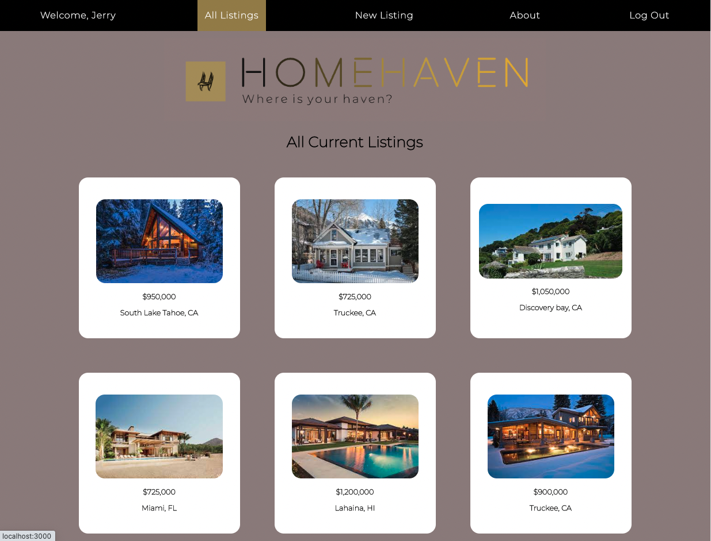
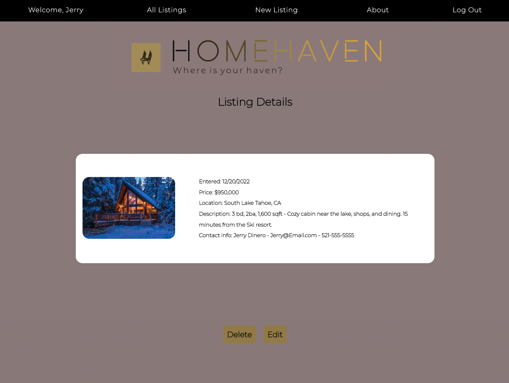
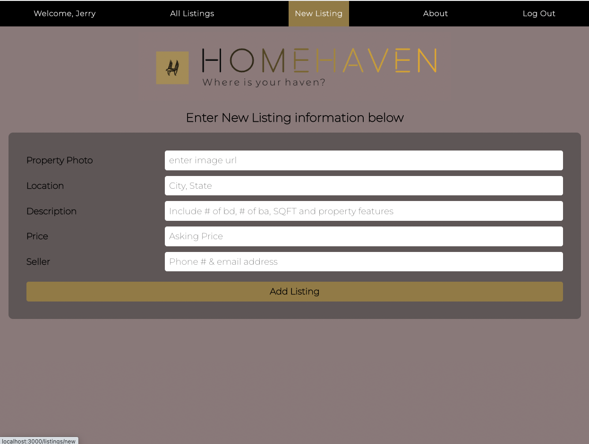
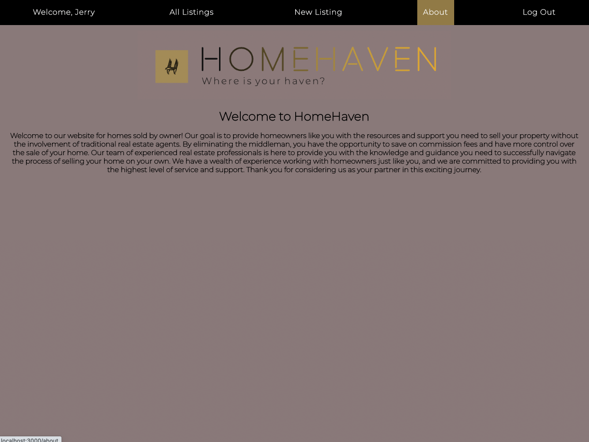

# HomeHaven

## Mission Statement

<h3>Welcome to our website for homes sold by owner! Our goal is to provide homeowners like you with the resources and support you need to sell your property. You will have control over the sale of your home. Our team of experienced real estate professionals is here to provide you with the knowledge and guidance you need to successfully navigate the process of selling your home on your own. We have a wealth of experience working with homeowners just like you, and we are committed to providing you with the highest level of service and support. Thank you for considering us as your partner in this exciting journey.</h3>

## How To Use

<li>By clicking the link below, you will arrive at the landing page where you will have the option to either log in if you are a returning user or sign up if this is the first time visiting the website</li>

<li>Once either logged in, you will then arrive to the All Listings page which will give you all the current listings for homes for sell.</li>  

<li>To see further information of an interested property including the seller contact information, click on the listing.</li>

<li>If you have a HomeHaven that you would like to list, click on New Listing in the navigation bar and submit all the pertinent details.  Once submitted, your new listing will appear on the All Listings page.</li>

<li>To get additional information about the website, visit the About page.</li> 

## Technologies Used

## View

<a href="https://home-haven.herokuapp.com/">HomeHaven</a>
|
<a href="https://trello.com/b/hRn9zm6W/homehaven">Trello Board</a>

 
## Next Steps
<li>Include a comment section in the Details page</li>
<li>Afthe the ability to upload additional photots in the the details page.</li>
<li>Include a filter listings feature.</li>